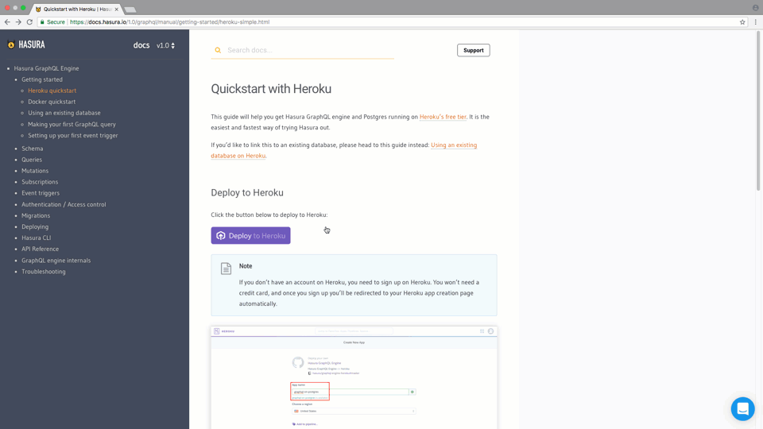

# Apollo GraphQL Seed Project

This repository can be used as a basic sturucture to start off with an [Apollo GraphQL](https://www.apollographql.com/) service. I have made sure most of the heavy-lifting is done, and you can start off by simply cloning the repo and writing business logic. Things I have taken care of:

- [Typescript](https://www.typescriptlang.org/) setup for type safety and Object Oriented Structure
- [Dotenv](https://www.npmjs.com/package/dotenv) for configuration using .env.* files
- Efficient multistage [Docker](https://docs.docker.com/get-docker/) build (rebuilds a layer only if required) & [Docker-compose](https://docs.docker.com/compose/install/)
- Dependency Injection using [Inversify](https://www.npmjs.com/package/inversify)
- Hot Reload with debugger(for VS Code editor) using [nodemon](https://www.npmjs.com/package/nodemon) for fast development
- A basic structure for writing cron jobs using [node-cron](https://www.npmjs.com/package/cron)
- A simple directory structure in line with following convention:
  - **Controllers**: Contain application logic and passing user input data to service.
  - **Services**: The middleware between controller and repository. Gather data from controller, performs validation and business logic, and calling repositories for data manipulation.
  - **Repositories**: Layer for interaction with models and performing DB operations.
  - **Models**: Schema files with relationships defined.

[Hasura](https://hasura.io/) is a framework that provides a GraphQL query interface over a postgre database, I have used Hasura as an ORM and datasource in this project. You can use any other ORM over any other database of your choice.

## Getting Started

### Clone the repository

```bash
git clone https://github.com/subhankarshah/apollo-graphql-starter.git
cd apollo-graphql-starter
```

### Setup Node & Install Dependencies

[Install Node](https://nodejs.org/en/download/package-manager/) & Run

```bash
npm install
```

### Setup Hasura

Deploy Hasura with one-click on Heroku with the free Postgres add-on:

[](https://heroku.com/deploy?template=https://github.com/hasura/graphql-engine-heroku)

**Or** Deploy Hasura locally using Docker-compose

- [Install Docker](https://docs.docker.com/get-docker/)
- [Install Docker-compose](https://docs.docker.com/compose/install/)
- Run the following command

```bash
docker-compose up -d graphql-engine
```

### Create Schema in Hasura

Create a simple schema via Hasura Console as shown in the demo below:


Make the following schema for testing this repo (TODO: add migration to automate this)

- Create a `user` schema
- Create a `user` table, under this schema
- Create an `id` field of type UUID
- Create fields firstName, lastName, mobile, email of type Text

### Environment Variables

The following env varibles: NODE_ENV, HASURA_ADMIN_SECRET, HASURA_END_POINT
Are set in docker-compose.yaml for Docker deployments **OR** in nodemon.json for local development

All other env varialbes are set in .env.{NODE_ENV} files

### Development

For hot reload without debugger, run

```bash
npm run dev
```

For hot reload without debugger(VS code), run the command below and attach debugger to node process

```bash
npm run dev:debug
```

### Deployment using Docker

Run following commands

```bash
docker-compose build
docker-compose up -d apollo-graphql-server
```
